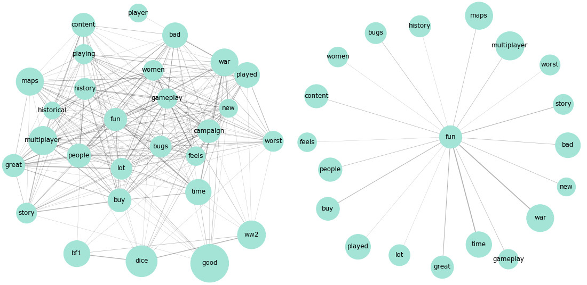

# PJ Battle
This project uses basic NLP (natural language proecessing) techniques to analyze customer reviews of 4 well known first-person shooting games: Battlefield 5, Battlefield 1, Call of Duty Black Ops 4, and Call of Duty Inifinite Warfare.  

First, I scrape the data from metacritic.com, tokenize customer reviews using the Spacy library and visualize word occurrences using bar charts, wordclouds, and network graphs. Second, I load nltk library and perform sentiment analysis to check whether the tone of customer reviews changed over time. Finally, I conduct topic analysis using sklearn built-in NLP capabilities to understand the dicussions points raised by Battlefield 5 players.

- Check commented [notebook](PJ_Battle.ipynb)

  

