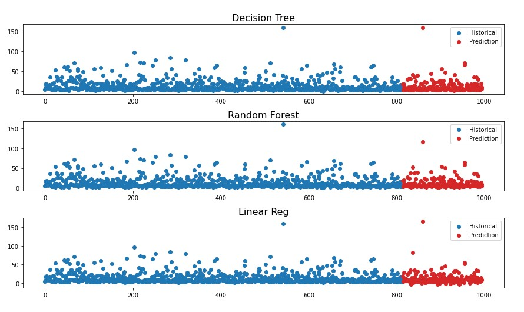

# PJ Car
This project is divided into two parts: 

Part 1 - Prediction) Predicted used car prices using Decision Tree, Random Forest, and Linear Regression. Dataset was prepared and shared by a user in Kaggle. This project was a refresher of basic (but essential) machine learning techniques.  

Part 2 - Inference) Used the same data to run a linear regression. In part 2, I focus on the interpretation of coefficients (in the story that the model tells about the relationship between features and target).  

- Check commented notebook: Part 1 [Jupyter notebook](Project_Car_Part1.ipynb) || Part 2 [Jupyter notebook](Project_Car_Part1.ipynb)

