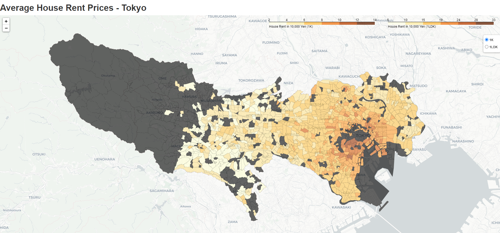

# PJ Flat
I created a map of Tokyo containing average rent prices broken down by district. This work was done over a weekend for hobby and learning during Summer 2021.
- Check commented notebook here: [Jupyter notebook](pj_flat_avgrentprices.ipynb)
- Check final output here: [HTML Output](https://brunoochi.github.io/my_data_science_portfolio/PJ_Flat/chintai_tokyo.html)

