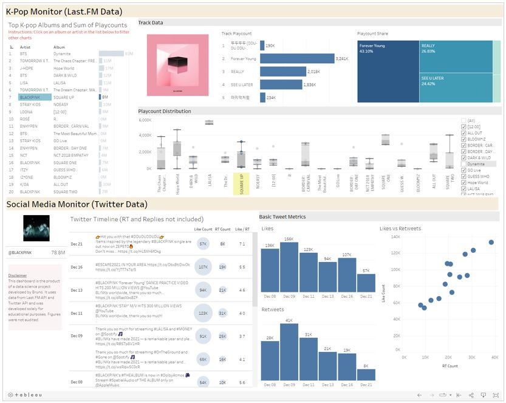

# PJ K
In this project, I create a developer account and set API accounts to extract publicly available data from music streaming service Last.FM and Twitter. I combine these two datasets to build a monitoring dashboard for top K-pop albums and artists.

The idea is to pratice data extraction using APIs. Even though I do have some experience using opensrouteservices API (for geographical distances, isochrones, and etc) at work, I have never really spent enough time to explore other major services, read the documentation texts and do some personal work. 

I also do quite a lot of data wrangling and some webscrapping to improve the quality of the data. As for the dashboard, I use Tableau Public to build a very simple visualization -  nothing really groundbreaking, just basic descriptive charts.  

- Check commented notebook here: [Jupyter notebook](pj_k.ipynb)
- Check final output here: [Tablau Dashboard](https://public.tableau.com/views/projectk_16396618958480/K-PopMonitorDB?:language=en-GB&publish=yes&:display_count=n&:origin=viz_share_link)

