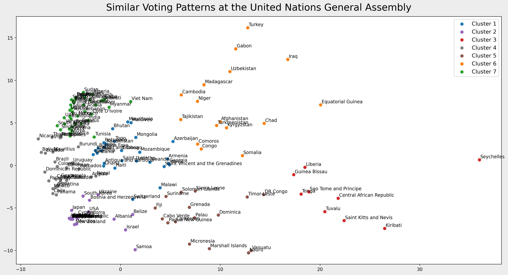

# PJ Resolution
The United Nations General Assembly (UNGA) is the forum where 193 nations convene to discuss world affairs. It is held once a year and nations express their positions by voting resolutions that will shape international law and politcs.

In this project, I use UNGA resolution data to understand voting patterns. I expect to see something that goes more or less along the lines of well known alliances such as the group of rich nations (G7), oil-rich countries (OPEP), former soviet countries being clustered together. Will these blocs really emerge as we expect? Or are countries defecting when it comes to passing UNGA resolutions?        

  - Check commented notebook here: [notebook](pj_resolution_analysis.ipynb)

